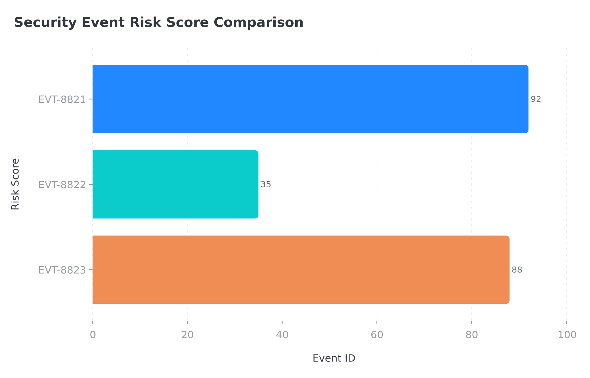

# Security Triage Consolidated Report

**Incident Date:** 2026-03-28  
**Time:** 08:24 GMT+8  
**Severity:** CRITICAL  
**Status:** Requires Immediate Action  

---

## 📊 Executive Summary

Three security events were analyzed. **Two events exceeded critical thresholds** and require immediate escalation. Both critical threats originate from the same source IP (`203.0.113.15`), indicating a coordinated multi-vector attack.

### Quick Stats
| Metric | Value |
|--------|-------|
| Total Events | 3 |
| Critical Events | 2 |
| Unique Threat Actors | 2 |
| Highest Risk Score | 92/100 |

---

## 🚨 Flagged Threats Summary

### Critical Threshold Rule
```
FLAG IF: risk_score > 80 OR threat_type CONTAINS 'stuffing'
```

### Flagged Events

| Event ID | Source IP | Threat Type | Risk Score | Flag Reason |
|----------|-----------|-------------|------------|-------------|
| **EVT-8821** | 203.0.113.15 | sql_injection | **92** | Risk score > 80 |
| **EVT-8823** | 203.0.113.15 | credential_stuffing | **88** | Risk score > 80 + 'stuffing' |

### Unique Source IPs Associated with Flagged Threats

**PRIMARY THREAT ACTOR:** `203.0.113.15`

This IP is responsible for **100% of critical events**:
- SQL Injection (EVT-8821) — Database exploitation attempt
- Credential Stuffing (EVT-8823) — Account compromise attempt

**SECONDARY IP (Below Threshold):** `192.0.2.44`
- Port Scan (EVT-8822) — Risk Score: 35 — Monitoring recommended

---

## 📈 Risk Score Visualization



*Bar chart showing disparity in threat levels across all logged events*

### Key Observations
- EVT-8821 (92) and EVT-8823 (88) represent **critical-severity threats**
- EVT-8822 (35) is **low-severity** but may indicate reconnaissance
- Risk score gap between highest and lowest: **57 points**

---

## 🔐 TLS 1.3 Configuration for AWS EFS (FIPS 140-2)

Full configuration specifications documented in: `aws-efs-tls13-fips-config.md`

### Key Requirements

| Component | Specification |
|-----------|--------------|
| **Protocol** | TLS 1.3 (minimum) |
| **Cipher Suites** | TLS_AES_256_GCM_SHA384, TLS_AES_128_GCM_SHA256 |
| **FIPS Mode** | Enabled (FIPS 140-2 compliant) |
| **Certificate Verification** | Required |
| **Hostname Verification** | Required |

### Critical Configuration Snippets

```ini
# /etc/amazon/efs/efs-utils.conf
[mount]
tls_enabled = true
tls_minimum_version = 1.3
fips_mode_enabled = true
verify_cert = true
verify_hostname = true
```

```bash
# Mount command with TLS 1.3 + FIPS
sudo mount -t efs tls fs-xxxxxxxx.efs.us-east-1.amazonaws.com:/ /mnt/efs \
  -o tls,tls-min=1.3,fips
```

```bash
# FIPS-approved cipher suites only
CipherString = TLS_AES_256_GCM_SHA384:TLS_AES_128_GCM_SHA256
```

**Note:** `TLS_CHACHA20_POLY1305_SHA256` is NOT FIPS 140-2 approved and must be excluded for strict compliance.

---

## ⚡ Immediate Action Items

### Priority 1 (Critical - Within 1 Hour)
- [ ] **Block IP `203.0.113.15`** at WAF and network perimeter
- [ ] Review database query logs for SQL injection success indicators
- [ ] Identify accounts targeted by credential stuffing attack
- [ ] Force password reset for affected accounts

### Priority 2 (High - Within 24 Hours)
- [ ] Enable rate limiting on authentication endpoints
- [ ] Implement account lockout policies after failed attempts
- [ ] Deploy additional monitoring for `192.0.2.44` (port scan source)
- [ ] Review and apply TLS 1.3 configuration to EFS mounts

### Priority 3 (Medium - Within 1 Week)
- [ ] Conduct full security audit of database access controls
- [ ] Implement Web Application Firewall (WAF) rules for SQL injection
- [ ] Deploy credential stuffing detection mechanisms
- [ ] Verify FIPS 140-2 compliance across all data transfer paths

---

## 📁 Deliverables

| File | Description |
|------|-------------|
| `security-triage-report.md` | Detailed event analysis and threat intelligence |
| `aws-efs-tls13-fips-config.md` | Complete TLS 1.3 + FIPS 140-2 configuration guide |
| `risk-score-comparison.png` | Visual bar chart of event risk scores |
| `SECURITY-TRIAGE-CONSOLIDATED.md` | This consolidated summary document |

---

**Report Generated:** 2026-03-28 08:34 GMT+8  
**Classification:** CONFIDENTIAL — Security Operations  
**Distribution:** Security Team, Infrastructure Team, SOC  

---

*This report was automatically generated by the Security Triage System. For questions or escalations, contact the Security Operations Center.*
